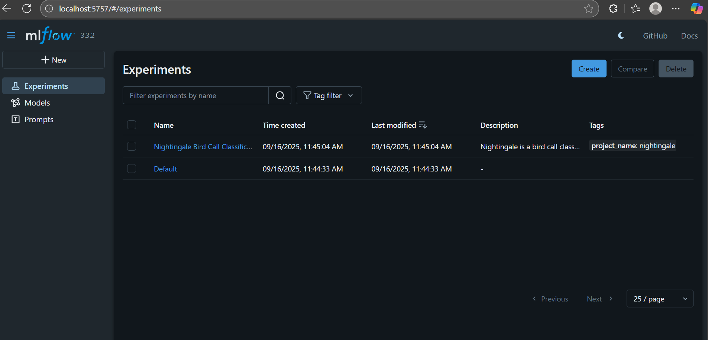

<p align="center">
  
</p>

# Nightingale - Discover birds by sound!

TODO: Tagline here

A lightweight, real-time bird call classifier with a sleek web app, ready for EDGE deployment and instant audio recognition anywhere.

## 📖 Overview

❗❗ This is a recently kicked off project and a work in progress. It is meant to become a bird call recognition app that can both run on the cloud and on the edge eventually. ❗❗

## Getting Started


### Prerequisites

* Git: https://git-scm.com/book/en/v2/Getting-Started-Installing-Git
* Docker Desktop: https://www.docker.com/products/docker-desktop/
* MLflow:
```bash
# Install mlflow locally
pip install mlflow
```
On Windows, if not already done, add the folder with the mlflow.exe to the environment variable path. The location of the mlflow.exe can be found running 
```bash
python -m site --user-base
```

### Download example data and models from kaggle

The data pipline and tracking server are not set up fully. A temporary solution to run an example is to download preprocessed bird call data and model artifacts of a pre-trained model.

The bird call data is in .wav format and resampled to 16kHz for three different birds and can be used as input to perform model inference. The the zipped data can be downloaded here:
https://www.kaggle.com/datasets/emilcode/nightingale-minimal-example

The pre-trained model is stored in a mlflow file-based meta store and in an artifact store. The zipped folder containing them can be downloaded here:
https://www.kaggle.com/models/emilcode/nightingale

After downloading the folders unzip them.

### Run mlflow tracking server
Open the bash/Git bash and change the directory to the unzipped folder containing the model.
```bash
# Change to directory containing the local mlflow tracking server state 
cd LocalMLflowTrackingServer

# Run the tracking server locally and accessible for the app from within a docker container
mlflow server --host 0.0.0.0 --port 5757
``` 

To check if the server is up and running, open a browser window a type "localhost:5757" into the address bar. You should see the UI for the MLflow server.
<p align="center">
  
</p>


### Clone git repository and run application

As soon as the mlflow tracking server is up and running, the pre-trained model is accessible for the application. To run the application locally, clone the repository, start the docker engine and then build and run the production docker container.

```bash
# Clone the repository
git clone https://github.com/emilcode-dev/nightingale

# Navigate to the project folder
cd nightingale

# Build container image
docker build -t nightingale-service:latest .

# Run the application
docker run -p 8080:8080 nightingale-service:latest
```

After the application has started, open your browser and enter "http://localhost:8080/static/index.html". You should be seeing the following locally hosted website. To try it out upload a .wav file of one of the three different brid species downloaded before.
Currently only the three bird types form the minimal example data are supported. More will be supported in the future with a more solid data pipeline. 😁
<p align="center">
  
</p>

## Developers


### Load data
In this current moment the data pipeline is not ready yet. Data is preprocessed and stored locally. 😬

### Train model
Open and run notebooks/train_nightingale.ipynb.

### Run example deployment of nightingale bird call classifier on localhost

```bash
cd app/fastapi
uvicorn main:app --reload --host 127.0.0.1 --port 8000
```

( or uvicorn app.fastapi.main:app --reload --host 127.0.0.1 --port 8000, but for that the import of the classifier_head model has to be done relativ e to the path etc. )

curl -X POST   "http://127.0.0.1:8080/predict/"   -H "accept: application/json"   -H "Content-Type: multipart/form-data"
 -F "file=@data/birdclef-2024/train_audio_16/cohcuc1/XC19645.wav;type=audio/wav"

# how to setup ml flow tracking server on your local machine 
On windows:
* Install chocolatey package manager
    - Follow installation instructions as decribed here: https://chocolatey.org/install?_gl=1*13ngmui*_ga*MTIyMDc5OTIxMC4xNzU3OTM4NDcx*_ga_0WDD29GGN2*czE3NTc5Mzg0NzAkbzEkZzEkdDE3NTc5Mzg1MzIkajYwJGwwJGgw
* Install python:
    - Open cmd window with admin rights, then run:
    ```
    choco install python
    ```
    - Close and reopen cmd window (no admin rights required here)
    ```
    pip install mlflow
    ```
* If not already done, add the folder with the mlflow.exe to  the environment variable path 
    Run the following command to find the folder (should return something like: C:\Users\<YourUser>\AppData\Roaming\Python\Python39\Scripts)
    ```
    python -m site --user-base
    ```
* Run local ml flow tracking server
    ```
    mlflow server --host 127.0.0.1 --port 5757
    ```
    or to access it from the docker dev container (check [Mlflow](https://www.mlflow.org/docs/latest/ml/tracking/server/#tracking-auth) for security considerations)
    ```
    mlflow server --host 0.0.0.0 --port 5757
    ```


  docker run -it --rm -p 5000:5000 \
  -v $(pwd)/LocalMLflowTrackingServer:/LocalMLflowTrackingServer/ \
  ghcr.io/mlflow/mlflow:v2.0.1 mlflow server --host 0.0.0.0 --port 5000 --default-artifact-root LocalMLflowTrackingServer/mlartifacts

  docker run -it --rm -p 5757:5757 \
  -v $(pwd)/LocalMLflowTrackingServer/mlruns:/mlflow/mlruns \
  -v $(pwd)/LocalMLflowTrackingServer/mlartifacts:/mlflow/mlartifacts \
  ghcr.io/mlflow/mlflow:v2.0.1 \
  mlflow server \
    --host 0.0.0.0 \
    --port 5757 \
    --default-artifact-root /mlflow/mlartifacts \
    --backend-store-uri /mlflow/mlruns


docker run -it --rm -p 5757:5757 \
  -v "$(pwd)/LocalMLflowTrackingServer/mlruns:/mlflow/mlruns" \
  -v "$(pwd)/LocalMLflowTrackingServer/mlartifacts:/mlflow/mlartifacts" \
  ghcr.io/mlflow/mlflow:v2.0.1 \
  mlflow server \
    --host 0.0.0.0 \
    --port 5757 \
    --default-artifact-root /mlflow/mlartifacts \
    --backend-store-uri file:/mlflow/mlruns

docker run -it --rm -p 5757:5757 -v "$(pwd)/LocalMLflowTrackingServer/mlruns:/mlflow/mlruns" -v "$(pwd)/LocalMLflowTrackingServer/mlartifacts:/mlflow/mlartifacts" ghcr.io/mlflow/mlflow:v3.3.2 mlflow server --host 0.0.0.0 --port 5757 --default-artifact-root /mlflow/mlartifacts --backend-store-uri file:/mlflow/mlruns
<!-- ## 📡 API / Features

*Describe the core modules, endpoints, or features.*

* Feature 1
* Feature 2
* Feature 3

--- -->

## 🤝 Contributing

Contributions are welcome! 🎉

1. Fork the project and clone it
2. Create a new branch (`git checkout -b feature/your-feature`)
3. Commit your changes (`git commit -m 'Add new feature'`)
4. Push to your branch (`git push origin feature/your-feature`)
5. Open a Pull Request

Contributors: Ephraim Eckl, David Pellhammer

<!-- ## 🧪 Testing

```bash
# Run tests
npm test   # or pytest
``` -->

## 🛣 Roadmap

* [x] Setup local MLflow tracking server
* [ ] Setup remote MLflow tracking server in the cloud
* [ ] Setup Github actions pipeline
* [ ] Use DVC for data versioning
* [ ] Integrate ONNX
* [ ] IaC with Terraform
* [ ] Container orchestration with K8s
* [ ] Consider aspects of DevSecOps

<!-- ## 📝 Changelog

See [CHANGELOG.md](CHANGELOG.md) for version history.
 -->

## 📜 License

This project is licensed under the **MIT License** – see the [LICENSE](LICENSE) file for details.

## 🙏 Acknowledgements
* [YAMNet](https://github.com/tensorflow/models/tree/master/research/audioset/yamnet)

<!-- ## 📬 Contact -->
