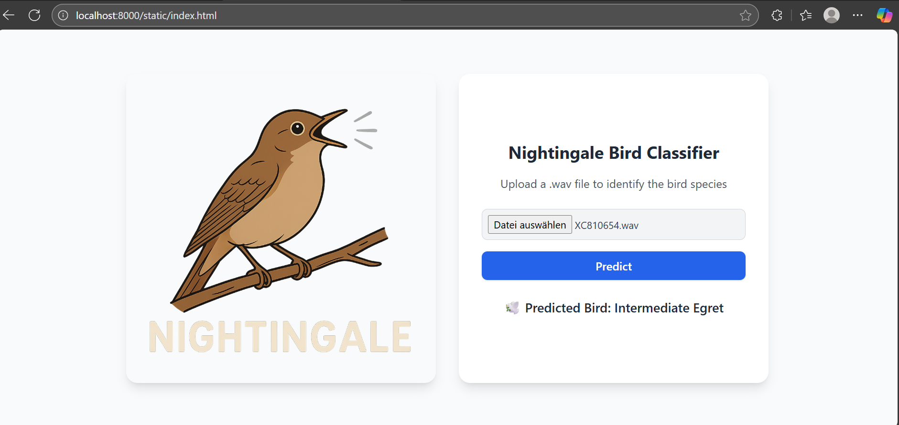

<p align="center">
  
</p>

# Nightingale - Discover birds by sound!

TODO: Tagline here

A lightweight, real-time bird call classifier with a sleek web app, ready for EDGE deployment and instant audio recognition anywhere.

## 📖 Overview

❗❗ This is a recently kicked off project and a work in progress. It is meant to become a bird call recognition app that can both run on the cloud and on the edge eventually. ❗❗

## 🎥 Screenshot

The following image depicts a screenshot of the current web application hosted locally.

(There will be a link to the web application here as soon as it has been pushed to the cloud.)

<p align="center">
  
</p>

## ⚙️ Installation

### Prerequisites

* Git
* Docker Desktop
* MLflow
* VS Code 
* Within VS Code install the extention Dev Containers (ms-vscode-remote.remote-containers)


### Steps

```bash
# Clone the repository
git clone https://github.com/emilcode-dev/nightingale

# Navigate to the project folder
cd nightingale

# Install dependencies
pip install -r requirements.txt
```

---

## 🚀 Usage

### Load data
In this current moment the data pipeline is not ready yet. Data is preprocessed and stored locally. 😬

### Train model
Open and run notebooks/train_nightingale.ipynb.

### Run example deployment of nightingale bird call classifier on localhost

```bash
cd app/fastapi
uvicorn main:app --reload --host 127.0.0.1 --port 8000
```

( or uvicorn app.fastapi.main:app --reload --host 127.0.0.1 --port 8000, but for that the import of the classifier_head model has to be done relativ e to the path etc. )

curl -X POST   "http://127.0.0.1:8080/predict/"   -H "accept: application/json"   -H "Content-Type: multipart/form-data"
 -F "file=@data/birdclef-2024/train_audio_16/cohcuc1/XC19645.wav;type=audio/wav"


# Deploy docker container with running application

cd nightingale
docker build -t nightingale-service:latest .
docker run -p 8080:8080 nightingale-service:latest
http://localhost:8080
(only works if there is a bird_classifier_head.keras in the toplevel directory of the repository)


# how to setup ml flow tracking server on your local machine 
On windows:
* Install chocolatey package manager
    - Follow installation instructions as decribed here: https://chocolatey.org/install?_gl=1*13ngmui*_ga*MTIyMDc5OTIxMC4xNzU3OTM4NDcx*_ga_0WDD29GGN2*czE3NTc5Mzg0NzAkbzEkZzEkdDE3NTc5Mzg1MzIkajYwJGwwJGgw
* Install python:
    - Open cmd window with admin rights, then run:
    ```
    choco install python
    ```
    - Close and reopen cmd window (no admin rights required here)
    ```
    pip install mlflow
    ```
* If not already done, add the folder with the mlflow.exe to  the environment variable path 
    Run the following command to find the folder (should return something like: C:\Users\<YourUser>\AppData\Roaming\Python\Python39\Scripts)
    ```
    python -m site --user-base
    ```
* Run local ml flow tracking server
    ```
    mlflow server --host 127.0.0.1 --port 5757
    ```
    or to access it from the docker dev container (check [Mlflow](https://www.mlflow.org/docs/latest/ml/tracking/server/#tracking-auth) for security considerations)
    ```
    mlflow server --host 0.0.0.0 --port 5757
    ```

<!-- ## 📡 API / Features

*Describe the core modules, endpoints, or features.*

* Feature 1
* Feature 2
* Feature 3

--- -->

## 🤝 Contributing

Contributions are welcome! 🎉

1. Fork the project and clone it
2. Create a new branch (`git checkout -b feature/your-feature`)
3. Commit your changes (`git commit -m 'Add new feature'`)
4. Push to your branch (`git push origin feature/your-feature`)
5. Open a Pull Request

Contributors: Ephraim Eckl, David Pellhammer

<!-- ## 🧪 Testing

```bash
# Run tests
npm test   # or pytest
``` -->

## 🛣 Roadmap

* [x] Setup local MLflow tracking server
* [ ] Setup remote MLflow tracking server in the cloud
* [ ] Setup Github actions pipeline
* [ ] Use DVC for data versioning
* [ ] Integrate ONNX
* [ ] IaC with Terraform
* [ ] Container orchestration with K8s
* [ ] Consider aspects of DevSecOps

<!-- ## 📝 Changelog

See [CHANGELOG.md](CHANGELOG.md) for version history.
 -->

## 📜 License

This project is licensed under the **MIT License** – see the [LICENSE](LICENSE) file for details.

## 🙏 Acknowledgements
* [YAMNet](https://github.com/tensorflow/models/tree/master/research/audioset/yamnet)

<!-- ## 📬 Contact -->
