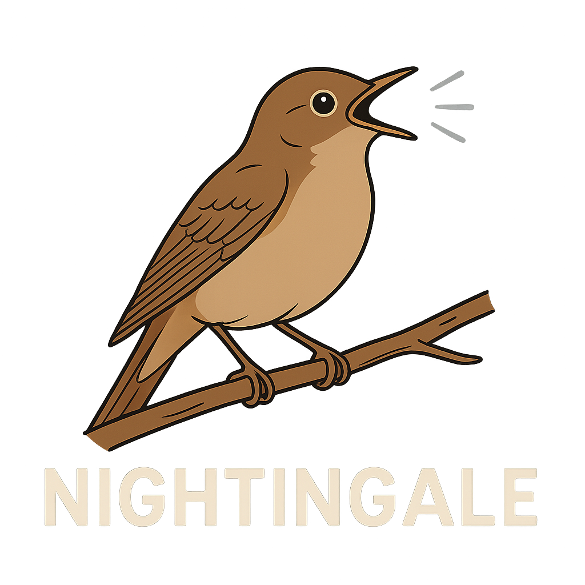
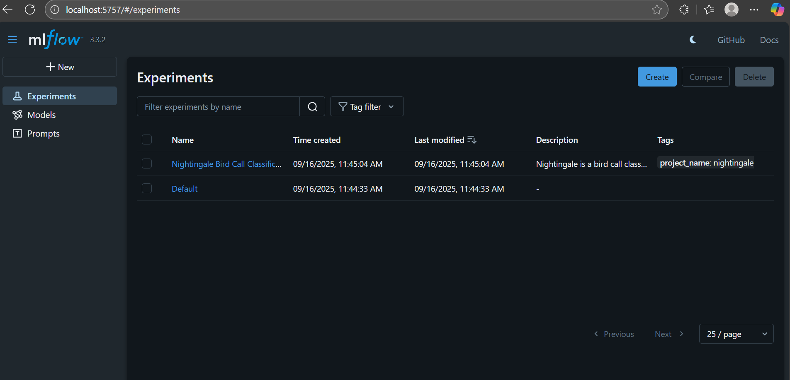
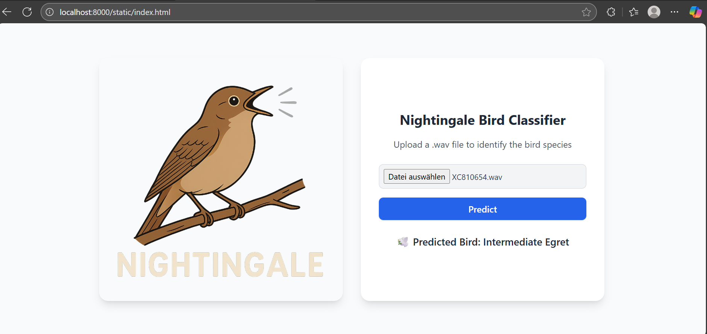

<p align="center">
  
</p>

# Nightingale - Discover birds by sound!
[](https://emilcode-dev.github.io/nightingale/)
[](https://github.com/emilcode-dev/nightingale/actions/workflows/build-and-publish-doc.yml)

A lightweight, real-time bird call classifier with a sleek web app, ready for EDGE deployment and instant audio recognition anywhere.

## 📖 Overview

❗❗ This is a recently kicked off project and a work in progress. It is meant to become a bird call recognition app that can both run on the cloud and on the edge eventually. ❗❗

This repository is going to be split in different repositories soon.
- nightingale (model and python package)
- nightingale-backend (backend with RESTful API using FastAPI, Docker, uvicorn, ...)

## 🚀 Getting Started

The following sections show which tools need to be installed, how to download the example data and model, how to run an MLflow tracking server with the downloaded model locally and shwo how to run the dockerized application.

### Prerequisites

* Git: https://git-scm.com/book/en/v2/Getting-Started-Installing-Git
* Docker Desktop: https://www.docker.com/products/docker-desktop/
* MLflow:
```bash
# Install mlflow locally
pip install mlflow
```
On Windows, if not already done, add the folder with the mlflow.exe to the environment variable path. The location of the mlflow.exe can be found running 
```bash
python -m site --user-base
```

### Download example data and models from kaggle

The data pipline and tracking server are not set up fully. A temporary solution to run an example is to download preprocessed bird call data and model artifacts of a pre-trained model.

The bird call data is in .wav format and resampled to 16kHz for three different birds and can be used as input to perform model inference. The the zipped data can be downloaded here:
https://www.kaggle.com/datasets/emilcode/nightingale-minimal-example

The pre-trained model is stored in a mlflow file-based meta store and in an artifact store. The zipped folder containing them can be downloaded here:
https://www.kaggle.com/models/emilcode/nightingale

After downloading the folders unzip them.

### How to set up a remote tracking server on your local host system
https://mlflow.org/docs/3.1.3/ml/tracking/tutorials/remote-server/

https://mlflow.org/docs/3.1.3/ml/tracking/server/

TODO!!!!

### Default tracking server
If you don't configure/set the MLFLOW_TRACKING_URI to a specific location, MLflow will create a mlruns directory in the CWD or your python run (e.g. next to the notebook if mlfow run has been started for the notebook).

### Use .env file to configure mlflow tracking server
MLFLOW_TRACKING_URI=<your-tracking-uri> (local file system or url to remote tracking server)
MLFLOW_EXPERIMENT_ID=<experiment_id>

### Set tracking server during container startup
Optional: To change the MLFLOW_TRACKING_URI during container startup add something like
    "containerEnv": {
        "MLFLOW_TRACKING_URI": "./mlruns"
    },
to the .devcontainer.json file.

### Setup mlflow to databricks
If you have a databricks account and you prefere to track your experiments and register your models to the databricks tracking server and unity catalog your can set up the connection doing the following.

https://docs.databricks.com/aws/en/mlflow3/genai/getting-started/tracing/tracing-ide?language=Use+a+.env+file

Create an .env file in your project root and add:
'''
DATABRICKS_TOKEN=<your-databricks-token>
DATABRICKS_HOST=<host-url-of-your-databricks-cloud> (something like: https://abc-a1234b12-a123.cloud.databricks.com)
MLFLOW_TRACKING_URI=databricks
MLFLOW_REGISTRY_URI=databricks-uc (for unity catalog)
MLFLOW_EXPERIMENT_ID=<experiment_id>
'''

The .env file will be ignored by git by default, but make sure to NOT commit and push your .env file as it contains credentials not meant to be public. 


### Run mlflow tracking server
Open the bash/Git bash and change the directory to the unzipped folder containing the model.
```bash
# Change to directory containing the local mlflow tracking server state 
cd LocalMLflowTrackingServer

# Run the tracking server locally and accessible for the app from within a docker container
mlflow server --host 0.0.0.0 --port 5757
``` 

To check if the server is up and running, open a browser window a type "localhost:5757" into the address bar. You should see the UI for the MLflow server.
<p align="center">
  
</p>


### Clone git repository and run application

As soon as the mlflow tracking server is up and running, the pre-trained model is accessible for the application. To run the application locally, clone the repository, start the docker engine and then build and run the production docker container.

```bash
# Clone the repository
git clone https://github.com/emilcode-dev/nightingale

# Navigate to the project folder
cd nightingale

# Build container image
docker build -t nightingale-service:latest .

# Run the application
docker run -p 8080:8080 nightingale-service:latest
```

After the application has started, open your browser and enter "http://localhost:8080/static/index.html". You should be seeing the following locally hosted website. To try it out upload a .wav file of one of the three different brid species downloaded before.
Currently only the three bird types form the minimal example data are supported. More will be supported in the future with a more solid data pipeline. 😁
<p align="center">
  
</p>

## 📟 Developers

Developers are encouraged to use the provided development container.

To run the dev container follow these steps:
1. Install VS Code: https://code.visualstudio.com/download.
2. Install Docker Desktop, if not done yet: https://www.docker.com/products/docker-desktop/.
3. Start VS Code and install the extension dev containers (ms-vscode-remote.remote-containers).
4. Restart VS Code to make sure the extension is active.
5. In VS Code go to File -> Open Folder and open the top level folder of this repository in VS Code.
6. VS Code will ask you to reopen the folder in the dev container, which you should do.

This will open and connect to the development container defined in .devcontainer/devcontainer.json and .devcontainer/Dockerfile. From then on you are working within the container and you are up and running.

More information on dev containers can be found here: https://code.visualstudio.com/docs/devcontainers/tutorial


### Load data
In this current moment the data pipeline is not ready yet. Data is preprocessed and stored locally. 😬

### Train model
Open and run notebooks/train_nightingale.ipynb.

### Run example deployment of nightingale bird call classifier on localhost

```bash
cd app/fastapi
uvicorn main:app --reload --host 127.0.0.1 --port 8000
```

The application API can be tested with
```bash
curl -X POST   "http://127.0.0.1:8080/predict/"   -H "accept: application/json"   -H "Content-Type: multipart/form-data"
 -F "file=@<path to audio data>XC19645.wav;type=audio/wav"
 ```

## 🤝 Contributing

Contributions are welcome! 🎉

1. Fork the project and clone it
2. Create a new branch (`git checkout -b feature/your-feature`)
3. Commit your changes (`git commit -m 'Add new feature'`)
4. Push to your branch (`git push origin feature/your-feature`)
5. Open a Pull Request

Contributors: Ephraim Eckl, David Pellhammer

<!-- ## 🧪 Testing

```bash
# Run tests
npm test   # or pytest
``` -->

## 🛣 Roadmap

* [x] Setup local MLflow tracking server
* [ ] Setup remote MLflow tracking server in the cloud or use databricks.
* [ ] Use DVC for data versioning
* [ ] Integrate ONNX
* [ ] IaC with Terraform
* [ ] Container orchestration with K8s
* [ ] Consider aspects of DevSecOps

<!-- ## 📝 Changelog

See [CHANGELOG.md](CHANGELOG.md) for version history.
 -->

## 📜 License

This project is licensed under the **MIT License** – see the [LICENSE](LICENSE) file for details.

## 🙏 Acknowledgements
* [YAMNet](https://github.com/tensorflow/models/tree/master/research/audioset/yamnet)
